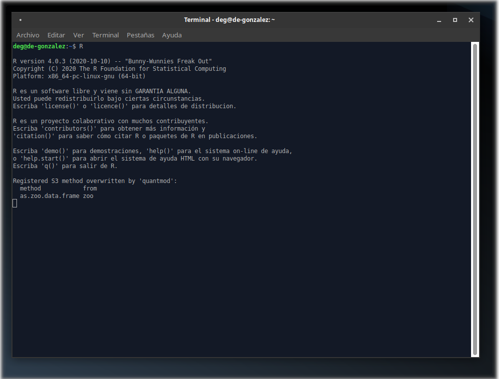
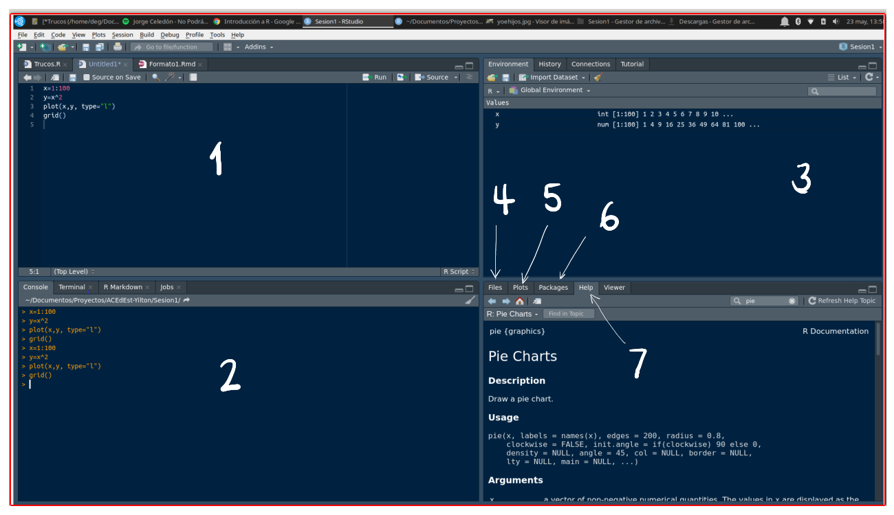
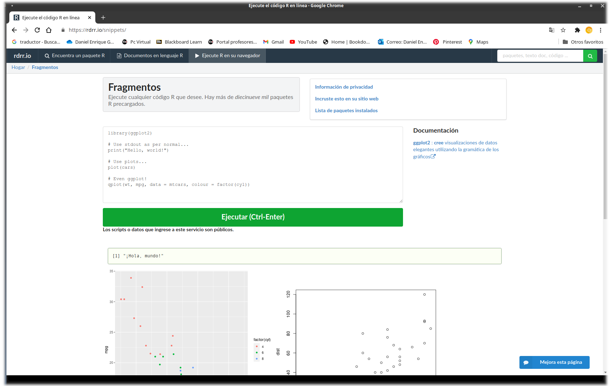
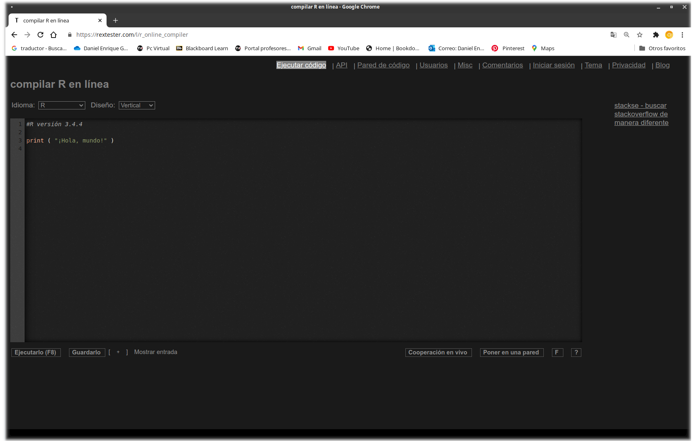

```{r setup, include=FALSE}

library(RColorBrewer)
library(readxl)
library(summarytools)
library(knitr)
library(readxl)
library(tidyverse)
bd0052 <- read_csv("data/datapye20212.csv")
```

# Metodología Estadística

1. Definición del problema
2. Definición de los objetivos
3. Definición de las variables de interés
4. Diseño del experimento
5. Recolección de la información
6. Procesamiento de los datos
7. Análisis descriptivo
8. Inferencia estadística
9. Conclusiones y recomendaciones

<br/><br/>
[P1: Grupo B](https://www.menti.com/e3pkm1854y) <br/>
[P2: Grupo B](https://www.menti.com/wxn9h6f27m) <br/><br/>

[P1: Grupo E](https://www.menti.com/95t8x5aqy8)<br/>
[P2: Grupo E](https://www.menti.com/fntyi5cohe)


---


# Entornos R - RStudio

<br/>

"RStudio es un entorno de desarrollo integrado para R, un lenguaje de programación para gráficos y computación estadística. Está disponible en dos formatos: RStudio Desktop es una aplicación de escritorio normal, mientras que RStudio Server se ejecuta en un servidor remoto y permite acceder a RStudio mediante un navegador web. "

Wikipedia

https://www.youtube.com/watch?v=rxsE3Uc_bnU&feature=emb_logo <br/>
Instalacion de R y RStudio <br/>
Rafa Gonzalez Gouvela


---
class: inverse

## R 



---
class: inverse
## RStudio



---
## R online
https://rdrr.io/snippets/ <br/>



---
## rextester

https://rextester.com/l/r_online_compiler <br/>


---
## Importar bases de datos

<br/><br/><br/>
+ Desde el menú de RStudio

+ Desde la consula de R o RStudio

+ De manera automática 


<br/><br/><br/><br/><br/><br/>
**Ayudas:** 
https://bookdown.org/gboccardo/manual-ED-UCH/gestion-de-bases-de-datos.html

---
# Importar los datos en formato xlsx 

+ RStudio usando ventanas : **File/ Import Dataset / From Excel...**

+ RStudio usando comandos : 

```{r, echo=TRUE, warning=FALSE, message=FALSE}
data("mtcars")
head(mtcars, n=3)
```

---

## Importar datos en formato csv
El formato **csv** es uno de los mas utilizados para el almacenamiento de datos estructurados (agrupados en filas y columnas)  . El termino csv significa *"valores separados por comas"* 

+ RStudio usando ventanas : **File/ Import Dataset / From Text (base)...**
+ RStudio usando comandos : 

```{r, echo=TRUE, warning=FALSE}
bd0052 <- read_csv("data/datapye20212.csv")
var1=c(1,4,5)
bd0052=bd0052[,var1]
head(bd0052, n=3)
```

---
## Importar datos de manera automática

La API de datos abiertos de Socrata le permite acceder mediante programación a una gran cantidad de recursos de datos abiertos de gobiernos, organizaciones sin fines de lucro y ONG de todo el mundo. Haga clic en el enlace de abajo y pruebe un ejemplo en vivo ahora mismo.

https://dev.socrata.com/

Cargar la base de datos de COVID-19 Colombia

```{r, eval=FALSE}
# install.packages("RSocrata")
 library(RSocrata)

 token ="ew2rEMuESuzWPqMkyPfOSGJgE"
 Colombia= read.socrata("https://www.datos.gov.co/resource/gt2j-8ykr.json", app_token = token)
 saveRDS(Colombia,"data/Colombia.RDS")
```

**Nota**: se requiere solicitar token en la pagina de los datos

https://www.datos.gov.co/

https://dev.socrata.com/foundry/www.datos.gov.co/gt2j-8ykr

---
## Revisión y ajuste de variables

```{r, eval=FALSE}
# Colombia=readRDS("Colombia.RDS")
 table(Colombia$sexo)
 table(Colombia$estado)
 table(Colombia$recuperado)
 table(Colombia$fuente_tipo_contagio)
 table(Colombia$ubicacion)

#      f       F       M 
#      1 1084422 1030174 

# Fallecido     Grave      leve      Leve      LEVE  moderado  Moderado 
#    54576      3560      4082   2023085         2         5     22250 
#      N/A 
#     7037 

#    Activo  fallecido  Fallecido        N/A Recuperado 
#     82659        295      54281       6020    1971342 

# En estudio  En Estudio  EN ESTUDIO   Importado Relacionado RELACIONADO 
#    1933003       23956          12        2363      155245          18 

#        casa         Casa         CASA    Fallecido     Hospital 
#        7048      2020114            7        54576        22255 
# Hospital UCI          N/A 
#        3560         7037 
```

Es necesario unificar la forma de escritura para un mismo nivel de una variable
---

```{r, eval=FALSE}
 library(stringr)
 Colombia$sexo=str_to_lower(Colombia$sexo)

 Colombia$estado[Colombia$estado=="N/A"]="NA"
 Colombia$estado=str_to_lower(Colombia$estado)

 Colombia$recuperado[Colombia$recuperado=="N/A"]="NA"
 Colombia$recuperado=str_to_lower(Colombia$recuperado)

 Colombia$fuente_tipo_contagio[Colombia$fuente_tipo_contagio=="N/A"]="NA"
 Colombia$fuente_tipo_contagio=str_to_lower(Colombia$fuente_tipo_contagio)

 Colombia$ubicacion[Colombia$ubicacion=="N/A"]="NA"
 Colombia$ubicacion=str_to_lower(Colombia$ubicacion)

```

**library(stringr)** <br/>
**Colombia$sexo=str_to_lower(Colombia$sexo)**

Importar (y exportar) datos en R <br/>
Vicente Coll & Pedro J. Pérez <br/>
https://www.uv.es/pjperez/curso_R/tt_3_cargar_datos_v4.html

---
## Actividad

<br/><br/><br/>
+ **Actividad 2** Baje una base de datos y revise que este bien, guardela en formato csv 
<br/><br/><br/>
+ **Actividad 3** :Instale R y RStudio  


---
class: inverse
background-image: url("img/tree-276014_1920.jpg")


## <p style="color:blue"> Daniel Enrique González Gómez </p>
Imagen tomada de : https://pixabay.com/es/images/search/paisaje/


