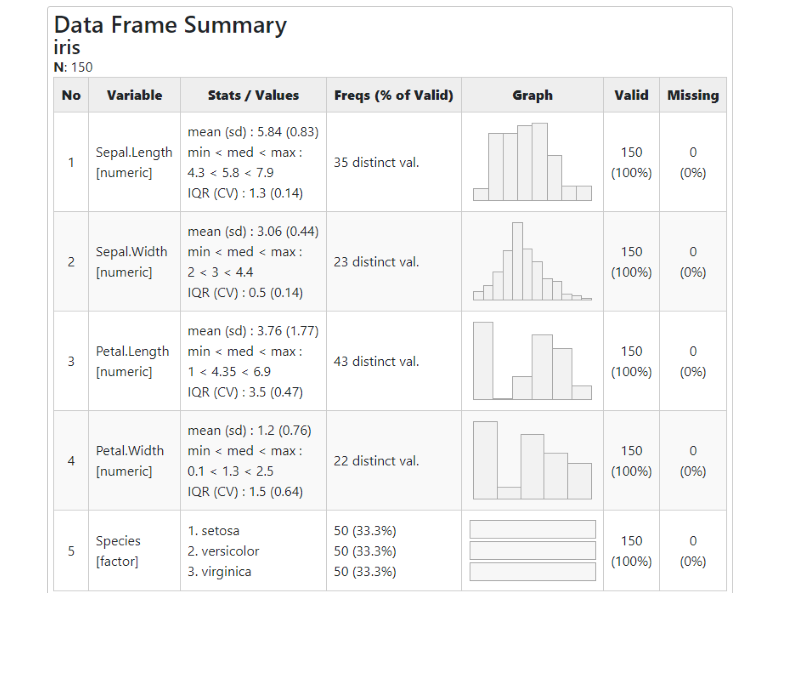
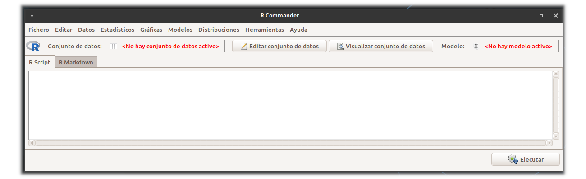

class: inverse
<br/><br/><br/>
# AGENDA
<br/><br/>
## 1.  Dudas y preguntas

## 2. Actividad 1

## 3. Cargar  de datos en RStudio

## 4. Varios

---
## Importar una base de datos en formato csv

Pasos:

+ Selecciono una base de datos de mi interés (portal **FiveThirtyEight**: https://data.fivethirtyeight.com/ - base de datos Predicción de clubes de  fútbol)
+ Descargo la base de datos y la guardo en la carpeta de trabajo
+ Importo la base a RStudio 
```{r, echo=TRUE, warning=FALSE, message=FALSE, results='hide'}
library(DT)
clasificacion=read.csv("data/spi_global_rankings_intl.csv")
DT::datatable(head(clasificacion, 218),fillContainer = FALSE, options = list(pageLength = 3))
```


Recuerda que hemos visto varias formas de hacerlo. 
---

+ Reviso la base de datos para poder detectar si presenta inconsistencias

```{r}
summary(clasificacion[,1:6])
```

---
+ Otra forma de realizar el proceso es:

```{r  message=FALSE}
summarytools::descr(clasificacion)
```

---
- Tambien :

```{r ,eval=FALSE, message=FALSE, warning=FALSE}
summarytools::dfSummary(clasificacion)
```


---
## Rcmdr
Este paquete de R permite cargar otra interz gráfica de usuarios que utiliza ventanas en lugar de comandos

```{r, eval =FALSE}
# install.packages("Rcmdr", dependencies = TRUE)
# install.packages("RcmdrMisc", dependencies = TRUE)
library(Rcmdr)
library(RcmdrMisc)
# Commander()  # en caso de cerrarlo y querer abrirlo nuevamente
```


Revisalo !

Ayuda: Tutorial Cómo Utilizar RCommander :https://www.youtube.com/watch?v=_aTYtNflcxU 


---
## Otros portales de datos abiertos

+ **kaggle**    https://www.kaggle.com

+ **FiveThirtyEight**    https://data.fivethirtyeight.com/

+ **Datos abiertos Cali**  https://datos.cali.gov.co/

+ **The home of the U.S. Government’s open data** https://www.data.gov/

+ **World Bank Open Data** https://data.worldbank.org/

+ **Open data initiative of the Government of Spain** https://datos.gob.es/en

---
class: inverse
background-image: url("img/railway-1555348_1920.jpg")

	<br/><br/><br/><br/><br/><br/><br/><br/><br/><br/><br/><br/>
# <p style="color:yellow"> Sigamos adelante... </p>

## <p style="color:yellow"> Daniel Enrique González Gómez </p>

Imagen tomada de :https://pixabay.com/es/images/search/paisaje/
