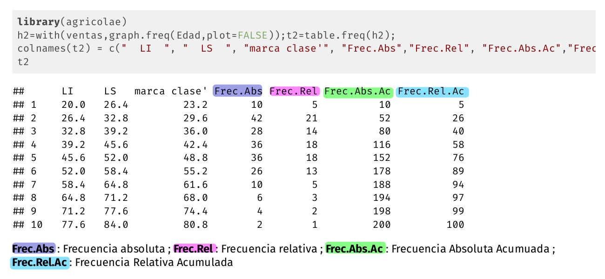
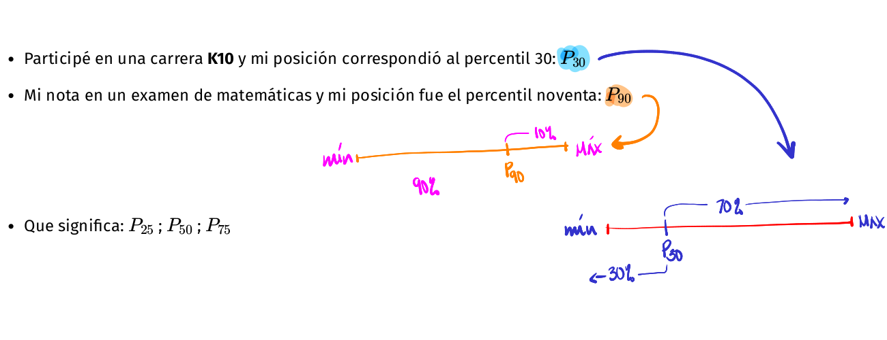
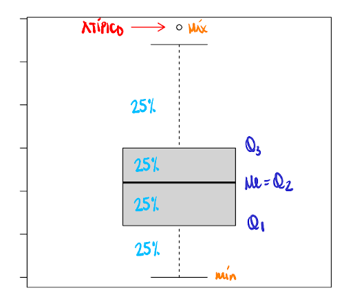
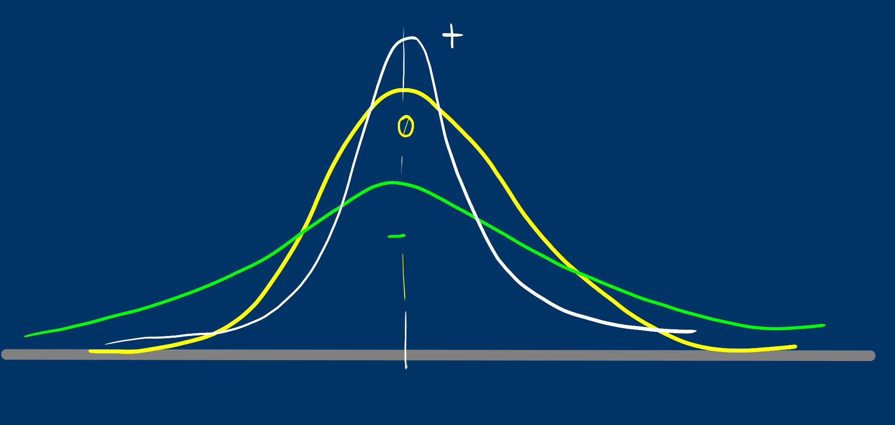

```{r setup, include=FALSE}

library(RColorBrewer)
library(readxl)
library(summarytools)
library(knitr)
library(readxl)
library(tidyverse)
ventas <- read_csv("data/ventas.csv")
futbol = read_csv("data/futbol.csv")
Colombia = readRDS("data/Colombia.RDS")
Colombia$edad=as.numeric(Colombia$ed)
pye20212=read_csv("data/datapye20212.csv")
```

class: inverse
<br/><br/><br/>
# AGENDA
<br/>
## 1.  Presentación guía de aprendizaje 1.2

## 2. Tablas de frecuencia 

## 3. Indicadores estadísticos

## 4. Varios

---


---
class: inverse
background-image: url("img/tablero1.jpg")
<br/><br/><br/><br/><br/><br/><br/><br/><br/><br/><br/><br/><br/><br/><br/>
## Indicadores
### ¿Que son?
---
## Tablas de freciencia variables cualitativas

.pull-left[
Las distribuciones de frecuencia o también llamadas tablas de frecuencia nos sirven para agrupar los datos y asi permitir resumir para poder tener una idea mas clara de sus características.

Para las variables cualitativas la tabla posee 3 columnas : 

+ C1: los diferentes **valores** que toma la variable. 

+ C2:  **frecuencia absoluta** que consiste en el conteo para cada uno de los valores distintos que toma la variable. 

+ C3: **frecuencia relativa ** que corresponde  al porcentaje la cantidad de datos para cada los valores
]
.pull-right[
```{r, echo=TRUE, message=FALSE, warning=FALSE}
# Forma simple
table(ventas$Tipo_Cliente)
```


```{r, echo=TRUE, message=FALSE, warning=FALSE}
# Forma simple
t=table(ventas$Tipo_Cliente)
prop.table(t)
```
]

---

```{r, message=FALSE}
#utilizando summarytools
library(summarytools)
t1=freq(ventas$Metodo_Pago, cumul = FALSE, headings = FALSE)
t1
```

En la tabla se destacan las frecuencias obtenidas por la tarjegta Star Card que se pueden interpretar :
+ 140 de los clientes utilizan la tarjeta Star Card para sus compras
+ El 70% de los clientes utilizan la tarjeta Star Card para sus compras
Nota: paquete [summarytools](https://cran.r-project.org/web/packages/summarytools/vignettes/Introduction.html) 
---
## Tablas de frecuencia para variables cuantitativas

Para las variables cuantitativas las tablas de frecuencias tiene una presentación diferente a la vista anteriormente. Como se trata de variables con una gran numero de valores diferentes, es necesario dividirlas por intervalos .

 

**Frec.Abs** : Frecuencia absoluta ; **Frec.Rel** : Frecuencia relativa ; **Frec.Abs.Ac** : Frecuencia Absoluta Acumuada ;
**Frec.Rel.Ac** : Frecuencia Relativa Acumulada 

---

```{r}
library(stringr)
t1=freq(Colombia$estado, cumul = FALSE, headings = FALSE)
t1
```

---
## Rango percentil

Es un número que divide la muestra en dos partes. $x$ % de los datos de la muestra son iguales o menores que $P_x$ y un $(100-x)$ % por encima  de el.


 
+ Participé en una carrera **K10** y mi posición correspondió al percentil 30:    $P_{30}$

+ Mi nota en un examen de matemáticas y mi posición fue el percentil noventa:  $P_{90}$

<br/><br/><br/><br/>

--

+ Que significa: $P_{25}$ ; $P_{50}$ ;  $P_{75}$
---
## Diagrama de cajas 

*boxplot(ventas$Edad)*




atípico | $LI=Q_{1}- 1.5(Q_{3}-Q_{1})$ | $Q_{1}$ | $Q_{2}$ | $Q_{3}$ | $LS=Q_{3}+ 1.5(Q_{3}-Q_{1})$ |  atípico 

---
## Características de los  datos

.pull-left[
**Tendencia central**

+ media

+ mediana

+ moda

+ media truncada

+ rango medio

+ media armónica

+ media geométrica
]
.pull-right[
**Dispersión**

+ rango

+ varianza

+ desviación estándar

+ coeficiente de variación

**Forma**

+ sesgo o asimetría

+ curtosis
]
---
## Media aritmetica : 

$$\widehat{x}= \frac{1}{n} \sum_{i=1}^{n} x_{i}$$

Es una de los indicadores estadísticos mas conocidos

Propiedades de la media :
+ La suma de las desviaciones de los datos con respecto a la media es cero. $\sum (x_{i}-\bar{x})=0$.

+ La suma de los cuadrados de las desviaciones de los datos con respecto a un valor {\bf $a$} es mínimo cuando $a=\bar{x}$.

+ Si $x_{i}=k$ para todo $i$, entonces, $\bar{x}=k$.

+ Si todos los datos de una variable se multiplican por una constante $k$, es decir $y_{i}=kx_{i}$, entonces $\bar{y}=k\bar{x}$

+ Si $z_{i}=a x_{i}+b y_{i}$, donde: ***a***, ***b*** constantes y $x_{i}$, $y_{i}$ variables, entonces: $\bar{z}=a\bar{x}+b\bar{y}$. 

---
.pull-left[
```{r}
mean(Colombia$edad,na.rm = TRUE)
```


```{r}
mean(ventas$Edad, na.rm = TRUE)
```
]

--

.pull-right[
**PROBLEMA ** 
```{r}
x=1:10
x
cat("media :",mean(x))


```

```{r}
x[10]=20
x
cat("media :" ,mean(x))
```
]


---
## Mediana : 

.pull-left[
***Me*** :Es el número que divide la muestra en dos partes de igual proporción (50% : 50%). Es decir que corresponde a:

$P_{50} = D_{5} = Q_{2}$

Tambien es corresponde a la linea central del diagrama de cajas.

```{r}
median(Colombia$edad,na.rm = TRUE)
```
]
.pull-right[
```{r, warning=FALSE, message=FALSE, fig.height=5, fig.width=4}
boxplot(ventas$Edad)
grid()
```

La **Me** corresponde a la linea central de a caja en el diagrama de cajas
]
---
La mediana es mas robusta a los cambio en los datos extremos. En presencia de datos atípicos es mejor utilizar la mediana en lugar que la media.

```{r}
x=1:10
x
cat("mediana :" ,median(x))
```

```{r}
x[10]=20
x
cat("mediana :" ,median(x))
```
---
## La Moda  

**Mo** : Dato o valor que más se repite.
Es utilizada como medida de tendencia central en variables cualitativas o 
o en cuantitativas discretas con pocos valores. En una tabla o  gráfico se puede distinguir fácilmente. 
```{r, message=FALSE}
#utilizando summarytools
library(summarytools)
t1=freq(ventas$Metodo_Pago, cumul = FALSE, headings = FALSE)
t1
```

Moda : ** ? **

---
## Otras medidas de centro

+ Media truncada al 10%
```{r, warning=FALSE, message=FALSE}

mean(ventas$Ventas_Netas, na.rm = TRUE, trim = 0.10)
```

+ **Rango medio** : $\frac{1}{2}(max(x)+min(x))$
```{r, warning=FALSE, message=FALSE}
(max(ventas$Ventas_Netas,na.rm = TRUE)+min(ventas$Ventas_Netas,na.rm = TRUE))/2
```

+ **Media geométrica** : este indicador de tendencia central se utiliza para promediar tasa de crecimiento o de interes. Para encontar su valor se multiplican los valores de $n$ tasas incrementadas en uno. A ese producto se le extrae la raiz n-esima.

+ **Media armónica** : Este indicador corresponde al inverso de la media aritmética 

---
class: inverse
## Problema reconocimiento de grupo
--

.pull-left[
**Grupo 1** <br/><br/>
Edades : 19, 22, 18, 21 <br/>
Promedio : 20 años

]
.pull-right[
**Grupo 2**<br/>
Edades : 39, 38, 2, 1<br/>
Promedio : 20 años

]

Hace falta otro indicador que nos oriente de cual grupo hablamos cuando solo tenemos como información : media = 20 años.
---
# Indicadores de Dispersión

## Rango

$r = max(x) - min(x)$

En caso de los dos grupos:

**Grupo 1**  : <br/>
$\bar{x} = 20$ años  <br/>
$r = 4$ años

**Grupo 1**  : <br/>
$\bar{x} = 20$ años  <br/>
$r = 38$ años


Indicador muy útil cuando se deben realiar cálculos rápidos
---
## Varianza $s^{2}$

Es la medida de dispersión más utilizada en estadística y está definida por 

$$s^{2}=\frac{1}{n-1} \sum_{i=1}^{n} (x_{i}-\bar{x})^{2}$$

**Propiedades de la varianza**

+ $s^{2} = \frac{1}{n} \sum x_{i}^{2}- (\bar{x})^{2}$ 

+ La varianza es siempre no negativa  $s^{2} >=0$

+ La varianza de una constante es cero $s_{k}^{2}=0$

+ Si $y_{i}=k x_{i}$, entonces $s_{y}^{2}= k^{2} s_{x}$

+ Si $y_{i}=x_{i} + k$ , entonces  $s_{y}^{2} = s_{x}$

+ Si $z_{i} = a x_{i} + b y_{i}$, entonces $s_{z}^{2}$ = $a^{2}s_{x}^{2}$ + $b^{2}s_{y}^{2}$ + $2ab$ $cov(xy)$

La varianza se puede interpretar como el promedio de las diferencias cuadradas entre cada uno de los datos y la media
---
El problema de la varianza es su **interpretación**

--

Sus unidades son al cuadrado y en la mayoría de los casos no es posible interpretarlos. Por esta razón se optó por utilizar otra mediada de dispersión

### Desviación estándar 

Es la raíz cuadrada de la varianza

$$s=\sqrt{s^{2}}$$

**Nota** : no aplican todas las propiedades de la varianza

```{r}
cat( "Varianza           :",var(ventas$Edad),"\n") 
cat("Desviación estándar :",sd(ventas$Edad))
```
Aunque la desviación estándar reduce el problema debido a tener las mismas unidades de la variable, es útil para comparación de dos grupos

---
## Coeficiente de variación

Nos indica que tan grande o que tan pequeña es la desviación estándar con respecto a su media

$$CV= \dfrac{s}{\bar{x}} \times 100 \% $$

Existen diferentes reglas empíricas para la interpretación del coeficiente de variación. Una de ellas establece como límite el 20% para separar los grupos homogéneos de los heterogéneos Por lo general se utiliza un valor hasta el 20% para determinar que un grupo de datos son homogéneos, de lo contrario se calificará como heterogéneo.

```{r}
cat("Coeficiente de variación :",sd(ventas$Edad)/mean(ventas$Edad)*100)
```

---
class: inverse
# Indicadores de forma

## Curtosis

Se mide a través del coeficiente de curtosis que mide cuan **puntiaguda** es una distribución respecto a la curva de la distribución normal entandar.

De acuerdo con su valor, la puntudez de los datos puede clasificarse en tres grupos:

+ **Leptocúrtica**, con valores grandes para el coeficiente (CA>0)

+ **Mesocúrtica**, con valores medianos para el coeficiente (CA=0)

+ **Platicútrica**, con valores pequeños para el coeficiente (CA<0) 



---
class: inverse
## Asimetría o sesgo

Mide que tanto la forma de la distribución de frecuencias de los datos es simétrica o no con respecto a la media. Esta característica de los datos se mide a través del coeficiente de asimetría o sesgo.

+ Es **simétrica** si el  valor del indicador es 0 ( $\bar{x}=Me$ )

+ Es **asimétrica a la izquierda** si el valor del indicador es negativo ( $\bar{x}<Me$ )

+ Es **asimétrica a la derecha** si el valor del indicador es positivo ( $\bar{x}>Me$ )


+ **Asimetria negativa ** : Poco con poco, mucho con mucho
+ **Simetrica** : Poco con poco, poco con mucho, mucho al rededor de un centro
+ **Asimetria positiva** : Mucho con poco, poco con mucho
---

.pull-left[
```{r, message=FALSE, warning=FALSE}
summarytools::descr(Colombia$edad)

```
]

.pull-right[
```{r}
summarytools::descr(ventas$Edad)
```
]
---
.pull-left[
```{r, message=FALSE, warning=FALSE}
d1=density(Colombia$edad, na.rm=TRUE)
plot(d1)
```
]
.pull-right[
```{r, message=FALSE, warning=FALSE}
d2=density(ventas$Edad) 
plot(d2)

```
]
---
## Actividades
<br/>
+ **Actividad 1** : Solución del caso 101
    + **Nota**: RMarkdown permite realizar el trabajo fácilmente

<br/>
+ **Actividad 2** : A partir de la  información contenida en  la base de datos  seleccionada en la **Unidad 1.1**, realice un análisis de al menos una variable cualitativa y una cuantitativa teniendo como soportes las tablas de frecuencia y los indicadores estadísticos correspondiente.

<br/><br/><br/>
**Fecha**  : 08 agosto de 2021

**Hora**   : 23:59 hora local 
---
class: inverse
background-image: url("img/person-1245959_1920.jpg")

	<br/><br/><br/><br/><br/><br/><br/><br/><br/><br/><br/><br/>
# <p style="color:yellow"> Lo podemos lograr... </p>

## <p style="color:yellow"> Daniel Enrique González Gómez </p>

Imagen tomada de : https://pixabay.com/es/images/search/paisaje/

