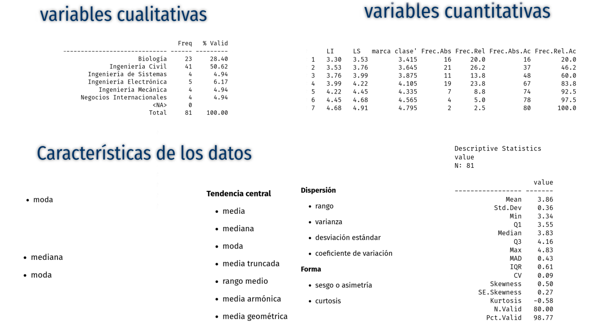

class: inverse
<br/><br/><br/>
# AGENDA
<br/>
## 1.  Dudas y preguntas

## 2. Actividad 

## 3. Varios

---

---
# Actividad

### Punto 1

1. Verdadero o falso: para cualquier lista de números, la mitad de ellos estará debajo de la media. (  )

1. ¿Es la media de la muestra siempre el valor que ocurre con más frecuencia? Si es así, explique por qué. Si no, dé un ejemplo. (  )

1. ¿La mediana de la muestra siempre es igual a uno de los valores de la muestra? Si es así, explique por qué. Si no, dé un ejemplo. (  )

1. Encuentre un tamaño de la muestra para el cual la mediana siempre sea igual a uno de los valores en la muestra. (  )

1. En cierta compañía, cada trabajador recibió un aumento de $150 mil por semana. ¿Cómo afecta esto la media de los sueldos? ¿Y la desviación estándar de los sueldos? (  )
---
### Punto 2 

Un grupo de  16 estudiantes mide la circunferencia de una pelota de tenis por cuatro métodos diferentes, éstos fueron:

+ **Método A**: Estimar la circunferencia a simple vista.
+ **Método B**: Medir el diámetro con una regla y después calcular la circunferencia.
+ **Método C**: Medir la circunferencia con una regla y cuerda.
+ **Método D**: Medir la circunferencia haciendo rodar la pelota a lo largo de una regla.

Los resultados (en cm) son los siguientes, en orden creciente para cada método:

```{r }
MétodoA=c(18.0, 18.0, 18.0, 20.0, 22.0, 22.0, 22.5, 23.0,24.0, 24.0, 25.0, 25.0, 25.0, 25.0, 26.0, 26.4)
MétodoB=c(18.8, 18.9, 18.9, 19.6, 20.1, 20.4, 20.4, 20.4,20.4, 20.5, 21.2, 22.0, 22.0, 22.0, 22.0, 23.6)
MétodoC=c(20.2, 20.5, 20.5, 20.7, 20.8, 20.9, 21.0, 21.0,21.0, 21.0, 21.0, 21.5, 21.5, 21.5, 21.5, 21.6)
MétodoD=c(20.0, 20.0, 20.0, 20.0, 20.2, 20.5, 20.5, 20.7,20.7, 20.7, 21.0, 21.1, 21.5, 21.6, 22.1, 22.3)
```

+ a) Calcule la media de las mediciones para cada método.

+ b) Calcule la mediana de las mediciones para cada método.

+ c) Calcule la media recortada a 20% de las mediciones para cada método.

---

+ d) Calcule el primero y el tercer cuartil para cada método.

+ e) Calcule la desviación estándar de las mediciones paracada método.

+ f) ¿En qué método es la desviación estándar más grande?. ¿Por qué se esperaría que este método tenga la desviación estándar más grande?

+ g) Sin que nada cambie ¿es preferible un método de medición que tenga una desviación estándar más pequeña o uno con una desviación estándar más grande? ¿O no importa? Explique.

+ h) Si las mediciones para uno de los métodos se convirtieran a pulgadas (1 pulgada = 2.54 cm), ¿cómo afectaría esto la media? ¿Y la mediana? ¿Y los cuartiles? ¿Y la desviación estándar?

+ i) Si los estudiantes midieran nuevamente la pelota, usando una regla marcada en pulgadas, ¿los efectos sobre la media, la mediana, los cuartiles y la desviación estándar serían los mismos que los del inciso h)? Explique.

---
### Punto 3 

Una clase de Probabilidad y Estadística con 40 estudiantes realizó una  prueba. El puntaje posible más alto era de cuatro puntos. Diez estudiantes obtuvieron cuatro puntos, 12 lograron tres puntos, ocho alcanzaron dos puntos, seis se beneficiaron con un punto y cuatro obtuvieron cero puntos. Calcule la media, la mediana y la desviación estándar de los puntajes.

### Punto 4

Otra clase de estadística de 60 estudiantes realizó la misma prueba. En este clase, 15 estudiantes obtuvieron cuatro puntos, 18 alcanzaron tres puntos, 12 lograron dos puntos, nueve obtuvieron un punto y seis resultaron con cero puntos. Calcule la media, la mediana y la desviación estándar de los puntajes.

### Punto 5

En otra clase de estadística, el número total de estudiantes no se conoce. En esta clase, 25% obtuvo cuatro puntos, 30% alcanzó tres puntos, 20% se benefició con dos puntos, 15% logró un punto y 10% resultó con cero puntos.

+ a. ¿Es posible calcular la media de los puntajes para esta clase? Si es así, calcúlela. Si no, explique por qué.
+ b. ¿Es posible calcular la mediana de los puntajes para esta clase? Si es así, calcúlela. Si no, explique por qué.
+ c. ¿Es posible calcular la desviación estándar de la muestra de los puntajes para esta clase? Si es así, calcúlela. Si no, explique por qué

**Nots**: Ejercicios tomados de Navidi(2006)
---
## Actividades unidad 1.2
<br/>
+ **Actividad 1** : Realice las  actividades consignadas en  el **Caso 101**.  Adjunte y envíe las respuesta a la plataforma de Brightspace en  formato pdf.

**Nota**: RMarkdown permite realizar el trabajo fácilmente

<br/>
+ **Actividad 2** : A partir de la  información contenida en  la base de datos  seleccionada en la **Unidad 1.1**, realice un análisis de al menos una variable cualitativa y una cuantitativa teniendo como soportes las tablas de frecuencia y los indicadores estadísticos correspondiente.

<br/><br/><br/>
**Fecha**  : 08 de agosto  2021

**Hora**   : 23:59 hora local 
---
class: inverse
background-image: url("img/the-road-815297_1280.jpg")

	<br/><br/><br/><br/><br/><br/><br/><br/><br/><br/><br/><br/>
# <p style="color:yellow"> Con trabajo lo podemos hace.... </p>

## <p style="color:yellow"> Daniel Enrique González Gómez </p>

Imagen tomada de : https://pixabay.com/es/images/search/paisaje/
